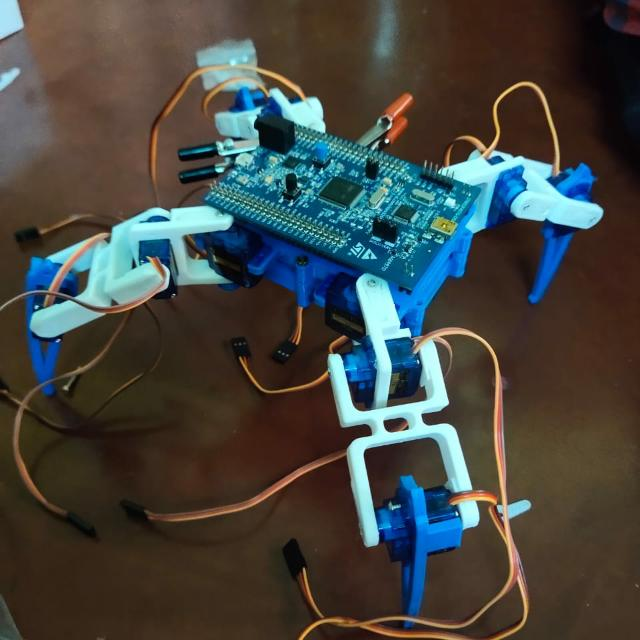

# Spider-Bot :spider_web:

As its name defines it, our robot is a basic representation of the spider movements, but it will not perform exactly the same body moves since we are using only four legs instead of eight legs.

Quadruped Robot – It is a four-legged walking robot which is a bionic replica of spider (Arachnid species) that uses their legs for movement and can perform some tasks either by human interaction or by its own.

## Glimpse of out project

## Parts used 

	- 12 SG90 servo motors.
	- 1 PCA9685 servo driver.
	- Arduino Uno.
	- Stm32F407G-DISC1.
	- 3D printed chasis .
	- Oled display (128x64).
	- Capacitor (2200μF-6.3V).
	- Power supply (5V-750mA).